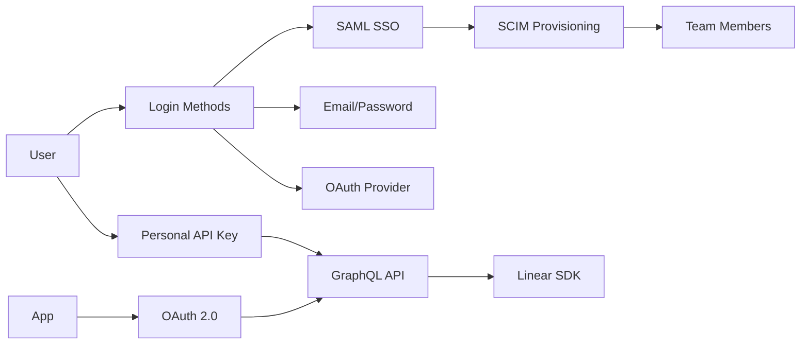
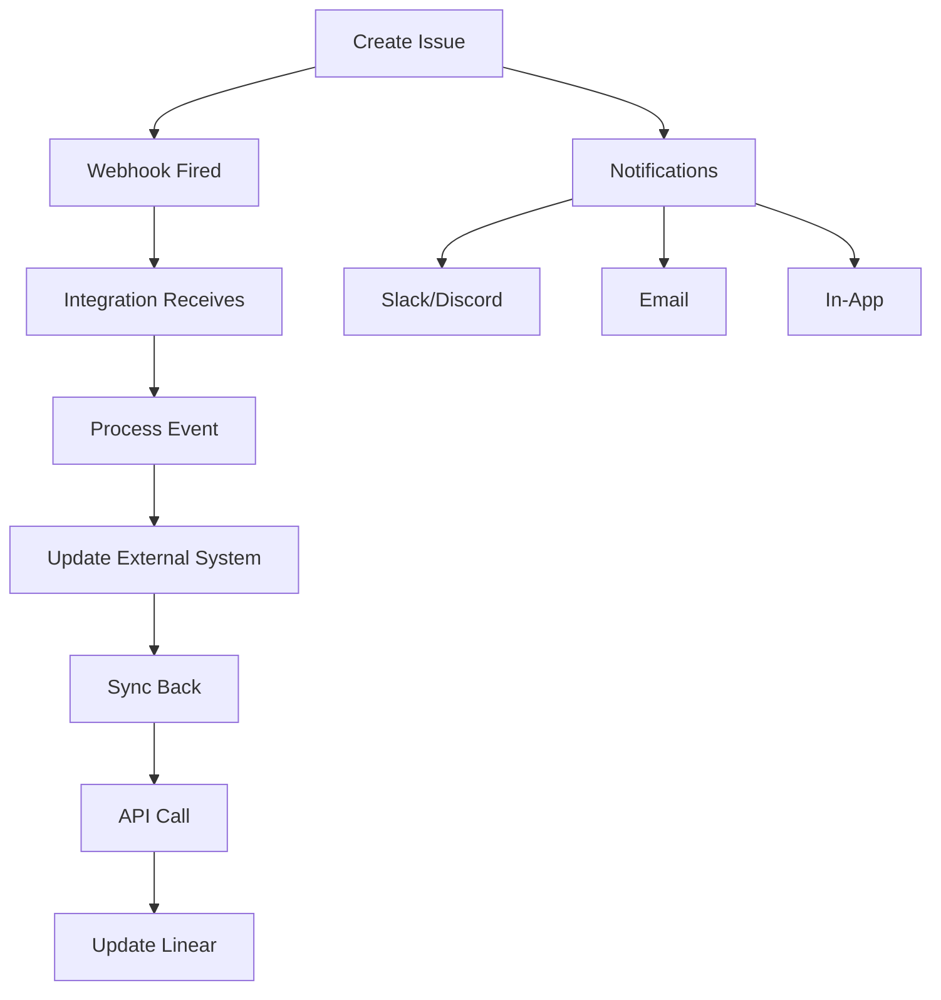

# Linear Documentation Knowledge Graph
*Semantic relationships for AI-powered information retrieval*

## 🧬 Core Concept Relationships

### Issue Ecosystem
```yaml
Issue:
  creates_with: [Templates, Quick Add, API, SDK]
  belongs_to: [Project, Team, Cycle, User]
  has_attributes: [Labels, Priority, Estimate, Due Date, Status]
  relates_to: [Parent Issue, Sub-issues, Dependencies, Blocks]
  transitions_through: [Workflow States]
  triggers: [Webhooks, Notifications, Automations]
  integrates_with: [GitHub, GitLab, Slack, Jira]
  
  documents:
    creation: [docs-creating-issues.md, developers-create-issues-using-linear-new.md]
    management: [docs-editing-issues.md, docs-assigning-issues.md]
    organization: [docs-parent-and-sub-issues.md, docs-issue-relations.md]
    attributes: [docs-labels.md, docs-priority.md, docs-estimates.md]
```

### Project Hierarchy
```yaml
Initiative:
  contains: [Projects]
  tracks: [Strategic Goals, OKRs]
  documents: [docs-initiatives.md]

Project:
  belongs_to: [Initiative, Team]
  contains: [Issues, Milestones, Documents]
  has_attributes: [Status, Priority, Lead, Labels]
  visualized_by: [Timeline, Graph, Board]
  documents:
    core: [docs-projects.md, docs-project-milestones.md]
    planning: [docs-beta-project-planning.md, docs-project-templates.md]
    tracking: [docs-project-status.md, docs-project-updates.md]

Cycle:
  belongs_to: [Team]
  contains: [Issues]
  measures: [Velocity, Completion Rate]
  documents: [docs-use-cycles.md, docs-cycle-graph.md]
```

### Team Structure
```yaml
Organization:
  contains: [Workspaces]
  manages: [Billing, Security, SSO]
  documents: [docs-workspaces.md, docs-billing-and-plans.md]

Workspace:
  contains: [Teams]
  configures: [Integrations, API Keys]
  documents: [docs-workspaces.md]

Team:
  contains: [Members, Sub-teams, Projects, Cycles]
  configures: [Workflows, Labels, Templates]
  documents: [docs-teams.md, docs-sub-teams.md, docs-private-teams.md]

Member:
  belongs_to: [Teams]
  has_role: [Admin, Member, Guest]
  owns: [Issues, Projects]
  documents: [docs-members-roles.md, docs-invite-members.md]
```

---

## 🔗 Feature Interconnections

### Authentication Flow


**Documents Chain**:
1. [Login Methods](docs-login-methods.md) →
2. [SAML & Access](docs-saml-and-access-control.md) →
3. [SCIM](docs-scim.md) →
4. [OAuth 2.0](developers-oauth-2-0-authentication.md) →
5. [GraphQL](developers-graphql.md) →
6. [SDK](developers-sdk.md)

### Data Flow Pipeline


**Documents Chain**:
1. [Creating Issues](docs-creating-issues.md) →
2. [Webhooks](developers-webhooks.md) →
3. [Integrations](docs-integration-directory.md) →
4. [Notifications](docs-notifications.md)

---

## 🎯 Task-Based Relationship Maps

### "I want to automate my workflow"
```yaml
Start: Workflow Automation
Paths:
  - Built-in:
    - docs-configuring-workflows.md (Workflow states)
    - docs-labels.md (Auto-labeling)
    - docs-project-templates.md (Templates)
    
  - Webhooks:
    - developers-webhooks.md (Event subscriptions)
    - developers-sdk-webhooks.md (SDK implementation)
    
  - Integrations:
    - docs-zapier.md (No-code automation)
    - docs-github.md (Git automation)
    - docs-slack.md (Notifications)
    
  - AI/Agents:
    - docs-agents-in-linear.md (AI agents)
    - docs-mcp.md (Model Context Protocol)
    - developers-agents.md (Agent API)
```

### "I want to migrate from Jira"
```yaml
Start: Jira Migration
Sequential_Path:
  1. Understanding:
     - docs-jira-terminology-translated.md (Term mapping)
     - docs-conceptual-model.md (Linear concepts)
  
  2. Preparation:
     - docs-teams.md (Set up teams)
     - docs-labels.md (Create labels)
     - docs-configuring-workflows.md (Map workflows)
  
  3. Migration:
     - docs-jira-to-linear.md (Migration guide)
     - docs-import-issues.md (Import process)
  
  4. Integration:
     - docs-jira.md (Keep Jira sync)
     - developers-webhooks.md (Real-time sync)
```

### "I want to build a Linear app"
```yaml
Start: Build Linear App
Learning_Path:
  1. Basics:
     - developers-graphql.md (API fundamentals)
     - developers-oauth-2-0-authentication.md (Authentication)
  
  2. Development:
     - developers-sdk.md (SDK setup)
     - developers-sdk-fetching-and-modifying-data.md (CRUD ops)
     - developers-filtering.md (Query data)
     - developers-pagination.md (Handle large datasets)
  
  3. Real-time:
     - developers-webhooks.md (Event subscriptions)
     - developers-sdk-webhooks.md (SDK webhooks)
  
  4. Advanced:
     - developers-file-storage-authentication.md (File uploads)
     - developers-attachments.md (Attachments)
     - developers-rate-limiting.md (Handle limits)
     - developers-sdk-errors.md (Error handling)
  
  5. Deployment:
     - developers-managing-customers.md (Multi-tenant)
     - developers-oauth-actor-authorization.md (User vs app actions)
```

---

## 🌐 Integration Dependency Graph

### Direct Integrations
```yaml
GitHub:
  requires: [OAuth, Webhooks]
  provides: [PR sync, Commit links, Status updates]
  documents: [docs-github.md]
  api_usage: [GraphQL, Webhooks]

Slack:
  requires: [OAuth, Webhooks]
  provides: [Notifications, Commands, Unfurling]
  documents: [docs-slack.md]
  api_usage: [Webhooks, GraphQL]

Figma:
  requires: [OAuth]
  provides: [Design links, Embeds]
  documents: [docs-figma.md]
  api_usage: [Attachments API]
```

### Indirect Integrations (via Zapier)
```yaml
Zapier:
  connects_to: [1000+ apps]
  common_workflows:
    - Email → Linear Issue
    - Linear → Google Sheets
    - Linear → Calendar
  documents: [docs-zapier.md]
  api_usage: [Webhooks, GraphQL]
```

---

## 🔄 State Machines

### Issue Lifecycle
```yaml
States:
  Backlog:
    transitions_to: [Todo, Canceled]
    triggers: [Prioritization, Refinement]
    
  Todo:
    transitions_to: [In Progress, Canceled]
    triggers: [Sprint Planning, Assignment]
    
  In Progress:
    transitions_to: [In Review, Blocked, Todo]
    triggers: [Work Started, PR Created]
    
  In Review:
    transitions_to: [Done, In Progress]
    triggers: [PR Approved, Changes Requested]
    
  Done:
    transitions_to: [Backlog] # Reopening
    triggers: [Completion, Deployment]
    
  Canceled:
    transitions_to: [Backlog] # Resurrection
    triggers: [Irrelevant, Duplicate]

Documents:
  - docs-configuring-workflows.md
  - docs-editing-issues.md
```

### Project Lifecycle
```yaml
States:
  Planning:
    transitions_to: [Started]
    activities: [Scoping, Resourcing]
    
  Started:
    transitions_to: [Paused, Completed]
    activities: [Development, Updates]
    
  Paused:
    transitions_to: [Started, Canceled]
    activities: [Review, Re-evaluation]
    
  Completed:
    transitions_to: [Archived]
    activities: [Retrospective, Documentation]

Documents:
  - docs-projects.md
  - docs-project-status.md
  - docs-initiative-and-project-updates.md
```

---

## 🏷️ Semantic Clusters

### Planning & Strategy
```yaml
Core_Concepts: [Initiatives, Projects, Milestones, Roadmap]
Documents:
  - docs-initiatives.md
  - docs-projects.md
  - docs-project-milestones.md
  - docs-timeline.md
  - docs-beta-project-planning.md
Related_Features: [Labels, Estimates, Dependencies]
```

### Execution & Delivery
```yaml
Core_Concepts: [Cycles, Issues, Workflows, Teams]
Documents:
  - docs-use-cycles.md
  - docs-creating-issues.md
  - docs-configuring-workflows.md
  - docs-teams.md
Related_Features: [Assignments, Priority, Due Dates]
```

### Monitoring & Analytics
```yaml
Core_Concepts: [Insights, Dashboards, Reports, Metrics]
Documents:
  - docs-insights.md
  - docs-dashboards.md
  - docs-product-intelligence.md
  - docs-cycle-graph.md
Related_Features: [Velocity, Completion Rate, SLA]
```

### Collaboration & Communication
```yaml
Core_Concepts: [Comments, Notifications, Integrations, Updates]
Documents:
  - docs-comment-on-issues.md
  - docs-notifications.md
  - docs-slack.md
  - docs-initiative-and-project-updates.md
Related_Features: [Mentions, Reactions, Threads]
```

---

## 🤖 AI Retrieval Strategies

### Query Expansion Rules
```yaml
When_User_Asks_About:
  "API":
    expand_to: [GraphQL, SDK, REST, Webhooks, OAuth]
    priority_docs: [developers-graphql.md, developers-sdk.md]
    
  "Integration":
    expand_to: [Specific integrations, Zapier, Webhooks]
    priority_docs: [docs-integration-directory.md]
    
  "Automation":
    expand_to: [Workflows, Webhooks, Zapier, AI Agents]
    priority_docs: [docs-configuring-workflows.md, developers-webhooks.md]
    
  "Security":
    expand_to: [SSO, SAML, SCIM, Audit, Permissions]
    priority_docs: [docs-security.md, docs-saml-and-access-control.md]
    
  "Migration":
    expand_to: [Jira, GitHub, Import, Export]
    priority_docs: [docs-jira-to-linear.md, docs-import-issues.md]
```

### Context Inclusion Rules
```yaml
Always_Include_With:
  GraphQL: [Authentication, Rate Limiting, Pagination]
  SDK: [Installation, Authentication, Error Handling]
  Webhooks: [Signature Verification, Event Types]
  Projects: [Initiatives, Milestones, Teams]
  Issues: [Labels, Workflows, Assignments]
```

### Confidence Scoring
```yaml
High_Confidence_Pairs:
  - Query: "create issue" → docs-creating-issues.md
  - Query: "api auth" → developers-oauth-2-0-authentication.md
  - Query: "webhook" → developers-webhooks.md
  - Query: "jira migration" → docs-jira-to-linear.md
  
Medium_Confidence_Needs_Context:
  - Query: "automation" → [workflows, webhooks, zapier]
  - Query: "permissions" → [roles, teams, security]
  
Low_Confidence_Needs_Clarification:
  - Query: "sync" → [integrations, webhooks, import/export]
  - Query: "update" → [issues, projects, software]
```

---

*Knowledge Graph v1.0 | 139 documents interconnected | Optimized for AI semantic understanding*