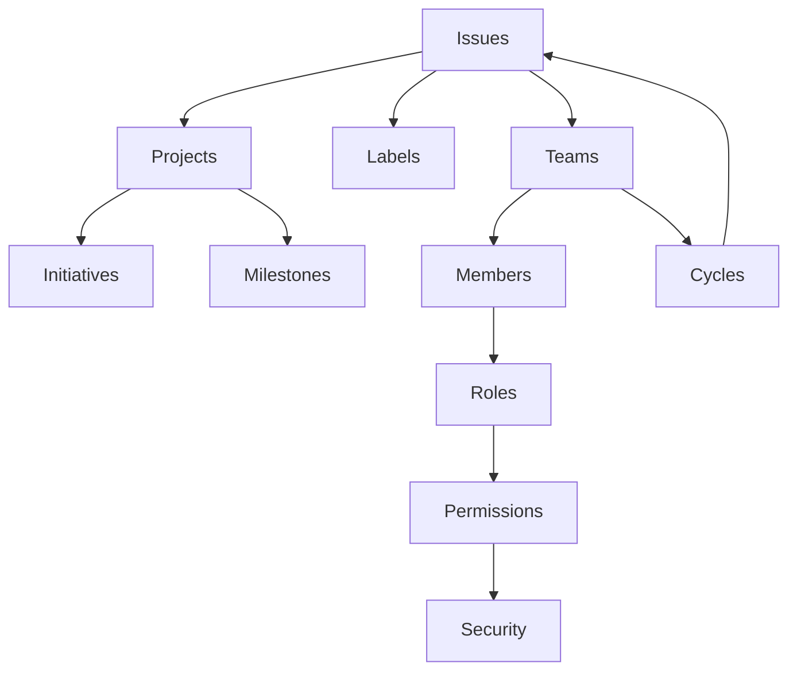
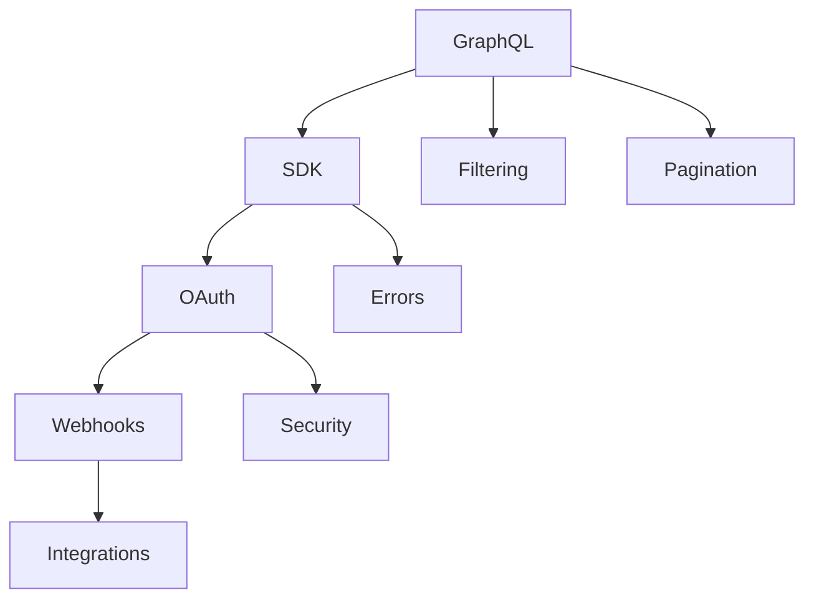
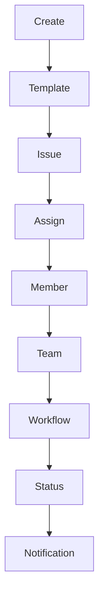

# Linear Documentation Master Index
*AI-Optimized Information Retrieval System*

## 🧠 Index Architecture

This documentation is organized using a **4-tier hierarchy** optimized for AI/RAG systems:

1. **Domains** → High-level areas (API, Product, Operations)
2. **Categories** → Functional groupings within domains
3. **Topics** → Specific features or concepts
4. **Documents** → Individual documentation files

### Quick Navigation
- [🔧 API & Development](#api--development)
- [📦 Product Features](#product-features)  
- [🏢 Enterprise & Operations](#enterprise--operations)
- [🎯 Use Case Guides](#use-case-guides)
- [🔄 Integrations](#integrations)
- [🏷️ Semantic Tags](#semantic-tags)
- [🔗 Relationship Graph](#relationship-graph)

---

## 🔧 API & Development
*Technical documentation for developers building on Linear*

### Core API
| Document | Description | Keywords | Related |
|----------|-------------|----------|---------|
| [GraphQL Fundamentals](developers-graphql.md) | GraphQL API basics, endpoint, introspection | `api`, `graphql`, `endpoint`, `query` | SDK, Pagination, Filtering |
| [Pagination](developers-pagination.md) | Relay-style cursor pagination | `pagination`, `cursor`, `relay`, `limits` | GraphQL, Filtering |
| [Filtering](developers-filtering.md) | Query filtering and data selection | `filter`, `query`, `selection`, `where` | GraphQL, Pagination |
| [Rate Limiting](developers-rate-limiting.md) | API limits and best practices | `rate-limit`, `throttle`, `quota`, `429` | GraphQL, Webhooks |
| [Deprecations](developers-deprecations.md) | Deprecated features and migrations | `deprecated`, `migration`, `breaking-change` | SDK Migration |

### Authentication & Security
| Document | Description | Keywords | Related |
|----------|-------------|----------|---------|
| [OAuth 2.0](developers-oauth-2-0-authentication.md) | OAuth2 implementation | `oauth`, `authentication`, `bearer`, `scope` | Actor Auth, File Storage |
| [OAuth Actor](developers-oauth-actor-authorization.md) | Actor authorization patterns | `actor`, `authorization`, `application`, `user` | OAuth 2.0 |
| [File Storage Auth](developers-file-storage-authentication.md) | File upload authentication | `file`, `upload`, `storage`, `s3` | Attachments |

### SDK & Client Libraries
| Document | Description | Keywords | Related |
|----------|-------------|----------|---------|
| [SDK Overview](developers-sdk.md) | TypeScript SDK setup | `sdk`, `typescript`, `client`, `install` | SDK Fetching, SDK Errors |
| [SDK Data Operations](developers-sdk-fetching-and-modifying-data.md) | CRUD operations via SDK | `fetch`, `mutation`, `create`, `update` | SDK Overview |
| [SDK Error Handling](developers-sdk-errors.md) | Error types and handling | `error`, `exception`, `retry`, `handling` | SDK Overview |
| [SDK Webhooks](developers-sdk-webhooks.md) | Webhook handling in SDK | `webhook`, `event`, `listener`, `realtime` | Webhooks |
| [SDK Migration 1.x→2.x](developers-migrating-from-1-x-to-2-x.md) | Migration guide | `migration`, `upgrade`, `breaking`, `v2` | SDK Overview |

### Advanced Features
| Document | Description | Keywords | Related |
|----------|-------------|----------|---------|
| [Webhooks](developers-webhooks.md) | Real-time event notifications | `webhook`, `event`, `push`, `notification` | SDK Webhooks |
| [Attachments](developers-attachments.md) | File attachments API | `attachment`, `file`, `upload`, `media` | File Upload Guide |
| [File Upload Guide](developers-how-to-upload-a-file-to-linear.md) | Step-by-step upload | `upload`, `file`, `attachment`, `s3` | Attachments |
| [Advanced Usage](developers-advanced-usage.md) | Complex patterns | `advanced`, `pattern`, `optimization` | All API docs |

### AI & Automation
| Document | Description | Keywords | Related |
|----------|-------------|----------|---------|
| [AI Agents](developers-agents.md) | AI agent integration | `ai`, `agent`, `automation`, `bot` | AIG, Linear AI |
| [AIG Framework](developers-aig.md) | AI generation framework | `ai`, `generation`, `llm`, `automation` | Agents |
| [Linear New API](developers-create-issues-using-linear-new.md) | Quick issue creation | `create`, `quick`, `shortcut`, `new` | Creating Issues |

### Customer Management
| Document | Description | Keywords | Related |
|----------|-------------|----------|---------|
| [Managing Customers](developers-managing-customers.md) | Multi-tenant patterns | `customer`, `tenant`, `organization` | OAuth, Workspaces |

---

## 📦 Product Features
*User-facing features and functionality*

### Issue Management
| Document | Description | Keywords | Related |
|----------|-------------|----------|---------|
| [Creating Issues](docs-creating-issues.md) | Issue creation basics | `create`, `issue`, `ticket`, `task` | Templates, Quick Add |
| [Editing Issues](docs-editing-issues.md) | Modifying issue details | `edit`, `update`, `modify`, `change` | Creating Issues |
| [Assigning Issues](docs-assigning-issues.md) | Assignment and ownership | `assign`, `owner`, `responsible`, `delegate` | Teams, Members |
| [Comments](docs-comment-on-issues.md) | Issue discussions | `comment`, `discussion`, `thread`, `reply` | Issues, Notifications |
| [Issue Templates](docs-issue-templates.md) | Reusable templates | `template`, `preset`, `boilerplate` | Creating Issues |
| [Parent & Sub-issues](docs-parent-and-sub-issues.md) | Issue hierarchies | `parent`, `child`, `sub-issue`, `hierarchy` | Relations |
| [Issue Relations](docs-issue-relations.md) | Linking issues | `relation`, `link`, `dependency`, `block` | Parent & Sub |
| [Selecting Issues](docs-select-issues.md) | Bulk operations | `select`, `bulk`, `multiple`, `batch` | Editing Issues |
| [Delete & Archive](docs-delete-archive-issues.md) | Issue lifecycle | `delete`, `archive`, `remove`, `trash` | Issues |

### Issue Attributes
| Document | Description | Keywords | Related |
|----------|-------------|----------|---------|
| [Labels](docs-labels.md) | Categorization system | `label`, `tag`, `category`, `group` | Filters, Views |
| [Priority](docs-priority.md) | Priority levels | `priority`, `urgent`, `critical`, `p0` | SLA, Triage |
| [Estimates](docs-estimates.md) | Effort estimation | `estimate`, `points`, `effort`, `size` | Cycles, Planning |
| [Due Dates](docs-due-dates.md) | Deadlines and scheduling | `due`, `deadline`, `schedule`, `date` | Cycles, SLA |
| [SLA](docs-sla.md) | Service level agreements | `sla`, `response`, `resolution`, `time` | Priority, Support |

### Projects & Planning
| Document | Description | Keywords | Related |
|----------|-------------|----------|---------|
| [Projects Overview](docs-projects.md) | Project management | `project`, `plan`, `goal`, `objective` | Milestones, Initiatives |
| [Project Milestones](docs-project-milestones.md) | Key deliverables | `milestone`, `deliverable`, `checkpoint` | Projects |
| [Project Graph](docs-project-graph.md) | Visual dependencies | `graph`, `dependency`, `visualization` | Dependencies |
| [Project Dependencies](docs-project-dependencies.md) | Dependency management | `dependency`, `blocker`, `prerequisite` | Graph |
| [Project Documents](docs-project-documents.md) | Documentation | `document`, `spec`, `brief`, `prd` | Projects |
| [Project Templates](docs-project-templates.md) | Reusable structures | `template`, `blueprint`, `scaffold` | Projects |
| [Project Status](docs-project-status.md) | Status tracking | `status`, `progress`, `health` | Updates |
| [Project Updates](docs-initiative-and-project-updates.md) | Progress updates | `update`, `status`, `report` | Initiatives |
| [Project Labels](docs-project-labels.md) | Project categorization | `label`, `tag`, `category` | Labels, Projects |
| [Project Priority](docs-project-priority.md) | Prioritization | `priority`, `rank`, `importance` | Priority |
| [Project Notifications](docs-project-notifications.md) | Alerts & updates | `notification`, `alert`, `subscribe` | Notifications |
| [Beta Planning](docs-beta-project-planning.md) | New planning features | `beta`, `planning`, `roadmap` | Projects |

### Initiatives
| Document | Description | Keywords | Related |
|----------|-------------|----------|---------|
| [Initiatives](docs-initiatives.md) | Strategic objectives | `initiative`, `objective`, `strategy` | Projects |
| [Initiative Migration](docs-initiatives-migration.md) | Migration guide | `migration`, `upgrade`, `initiative` | Initiatives |

### Cycles & Sprints
| Document | Description | Keywords | Related |
|----------|-------------|----------|---------|
| [Using Cycles](docs-use-cycles.md) | Sprint management | `cycle`, `sprint`, `iteration`, `agile` | Planning |
| [Cycle Graph](docs-cycle-graph.md) | Sprint visualization | `graph`, `burndown`, `velocity` | Cycles |
| [Update Cycles](docs-update-cycles.md) | Cycle modifications | `update`, `modify`, `extend` | Cycles |

### Views & Navigation
| Document | Description | Keywords | Related |
|----------|-------------|----------|---------|
| [Custom Views](docs-custom-views.md) | Personalized views | `view`, `custom`, `filter`, `save` | Filters |
| [Board Layout](docs-board-layout.md) | Kanban boards | `board`, `kanban`, `column`, `swimlane` | Views |
| [Timeline](docs-timeline.md) | Gantt charts | `timeline`, `gantt`, `schedule` | Projects |
| [User Views](docs-user-views.md) | Personal views | `user`, `personal`, `my` | Custom Views |
| [Label Views](docs-label-views.md) | Label-based views | `label`, `view`, `filter` | Labels, Views |
| [Filters](docs-filters.md) | Data filtering | `filter`, `search`, `query` | Views, Search |
| [Display Options](docs-display-options.md) | UI customization | `display`, `layout`, `theme` | Views |
| [Favorites](docs-favorites.md) | Quick access | `favorite`, `star`, `bookmark` | Views |
| [Search](docs-search.md) | Search functionality | `search`, `find`, `query` | Filters |
| [Peek](docs-peek.md) | Quick preview | `peek`, `preview`, `quick-view` | Views |

### Team Features
| Document | Description | Keywords | Related |
|----------|-------------|----------|---------|
| [Inbox](docs-inbox.md) | Personal inbox | `inbox`, `notification`, `unread` | Notifications |
| [My Issues](docs-my-issues.md) | Assigned issues | `my`, `assigned`, `personal` | User Views |
| [Pulse](docs-pulse.md) | Activity feed | `pulse`, `activity`, `feed`, `updates` | Notifications |
| [Default Pages](docs-default-team-pages.md) | Team homepages | `default`, `homepage`, `landing` | Teams |
| [Triage](docs-triage.md) | Issue triage | `triage`, `prioritize`, `review` | Priority, Inbox |

### Workflow & Process
| Document | Description | Keywords | Related |
|----------|-------------|----------|---------|
| [Configuring Workflows](docs-configuring-workflows.md) | Workflow setup | `workflow`, `process`, `state`, `transition` | Teams |
| [Triage Management](docs-triage-manage-unplanned-work.md) | Unplanned work | `triage`, `unplanned`, `interrupt` | Triage |
| [Customer Requests](docs-customer-requests.md) | External requests | `customer`, `request`, `support` | Integrations |
| [Team Issue Limit](docs-team-issue-limit.md) | WIP limits | `limit`, `wip`, `capacity` | Teams |

### Content & Editing
| Document | Description | Keywords | Related |
|----------|-------------|----------|---------|
| [Editor](docs-editor.md) | Rich text editor | `editor`, `markdown`, `format`, `rich-text` | Comments |
| [Hidden Content](docs-hidden-content-preview.md) | Content preview | `hidden`, `preview`, `collapsed` | Editor |

---

## 🏢 Enterprise & Operations
*Organization-wide features and administration*

### Organization Management
| Document | Description | Keywords | Related |
|----------|-------------|----------|---------|
| [Workspaces](docs-workspaces.md) | Workspace management | `workspace`, `organization`, `company` | Teams |
| [Teams Overview](docs-teams.md) | Team structure | `team`, `department`, `group` | Sub-teams |
| [Sub-teams](docs-sub-teams.md) | Team hierarchies | `sub-team`, `hierarchy`, `nested` | Teams |
| [Private Teams](docs-private-teams.md) | Access control | `private`, `restricted`, `confidential` | Teams, Security |
| [Invite Members](docs-invite-members.md) | User onboarding | `invite`, `onboard`, `add-user` | Members |
| [Members & Roles](docs-members-roles.md) | User management | `member`, `role`, `permission` | Security |

### Security & Compliance
| Document | Description | Keywords | Related |
|----------|-------------|----------|---------|
| [Security Overview](docs-security.md) | Security features | `security`, `encryption`, `compliance` | SAML, SCIM |
| [Security & Access](docs-security-and-access.md) | Access control | `access`, `permission`, `authorization` | Roles |
| [SAML & Access](docs-saml-and-access-control.md) | SSO configuration | `saml`, `sso`, `single-sign-on` | Security |
| [SCIM](docs-scim.md) | User provisioning | `scim`, `provisioning`, `directory` | SAML |
| [Audit Log](docs-audit-log.md) | Activity tracking | `audit`, `log`, `compliance`, `history` | Security |
| [Third-party Apps](docs-third-party-application-approvals.md) | App management | `third-party`, `oauth`, `apps` | Security |
| [API & Webhooks](docs-api-and-webhooks.md) | API security | `api`, `webhook`, `token` | Security |

### Account & Billing
| Document | Description | Keywords | Related |
|----------|-------------|----------|---------|
| [Account Preferences](docs-account-preferences.md) | User settings | `account`, `settings`, `preferences` | Profile |
| [Profile](docs-profile.md) | User profile | `profile`, `avatar`, `bio` | Account |
| [Notifications](docs-notifications.md) | Alert settings | `notification`, `alert`, `email` | Inbox |
| [Login Methods](docs-login-methods.md) | Authentication | `login`, `auth`, `password` | Security |
| [Billing & Plans](docs-billing-and-plans.md) | Subscription | `billing`, `subscription`, `payment` | Workspaces |

### Data Management
| Document | Description | Keywords | Related |
|----------|-------------|----------|---------|
| [Import Issues](docs-import-issues.md) | Data import | `import`, `migration`, `csv` | Export |
| [Exporting Data](docs-exporting-data.md) | Data export | `export`, `backup`, `csv` | Import |

### Analytics & Insights
| Document | Description | Keywords | Related |
|----------|-------------|----------|---------|
| [Insights](docs-insights.md) | Analytics overview | `analytics`, `metrics`, `insights` | Dashboards |
| [Dashboards](docs-dashboards.md) | Custom dashboards | `dashboard`, `report`, `visualization` | Insights |
| [Product Intelligence](docs-product-intelligence.md) | Usage analytics | `intelligence`, `usage`, `analytics` | Insights |

---

## 🎯 Use Case Guides
*Role-specific and scenario-based documentation*

### Getting Started
| Document | Description | Keywords | Related |
|----------|-------------|----------|---------|
| [Start Guide](docs-start-guide.md) | Quick start | `start`, `onboarding`, `setup` | Get App |
| [Get the App](docs-get-the-app.md) | Installation | `download`, `install`, `app` | Start Guide |
| [Conceptual Model](docs-conceptual-model.md) | Core concepts | `concept`, `model`, `terminology` | Start Guide |
| [View Demos](docs-view-demos.md) | Demo content | `demo`, `example`, `sample` | Start Guide |
| [Joining Your Team](docs-joining-your-team-on-linear.md) | Team onboarding | `join`, `onboard`, `team` | Invite Members |

### Migration Guides
| Document | Description | Keywords | Related |
|----------|-------------|----------|---------|
| [Jira to Linear](docs-jira-to-linear.md) | Jira migration | `jira`, `migration`, `import` | Import |
| [Jira Terminology](docs-jira-terminology-translated.md) | Term mapping | `jira`, `terminology`, `translation` | Jira to Linear |
| [GitHub to Linear](docs-github-to-linear.md) | GitHub migration | `github`, `migration`, `import` | Import |

### Team Size Guides
| Document | Description | Keywords | Related |
|----------|-------------|----------|---------|
| [How to Use Linear](docs-how-to-use-linear.md) | General guide | `guide`, `best-practice`, `usage` | All guides |
| [Small Teams](docs-how-to-use-linear-small-teams.md) | <10 people | `small`, `startup`, `tiny` | How to Use |
| [Startups/Mid-size](docs-how-to-use-linear-startups-mid-size-companies.md) | 10-100 people | `startup`, `medium`, `growth` | How to Use |
| [Large/Scaling](docs-how-to-use-linear-large-scaling-companies.md) | 100+ people | `enterprise`, `large`, `scale` | How to Use |

### Role-Specific
| Document | Description | Keywords | Related |
|----------|-------------|----------|---------|
| [Product Managers](docs-linear-for-product-managers.md) | PM guide | `pm`, `product`, `manager` | Projects |
| [Growth Teams](docs-linear-for-growth.md) | Growth guide | `growth`, `marketing`, `acquisition` | Ops & Marketing |
| [Ops & Marketing](docs-ops-and-marketing.md) | Non-eng guide | `operations`, `marketing`, `sales` | Growth |
| [Making Most of Linear](docs-making-the-most-of-linear.md) | Power user tips | `tips`, `advanced`, `productivity` | All guides |
| [Business Features](docs-making-the-most-of-linear-business.md) | Business guide | `business`, `enterprise`, `admin` | Making Most |

### AI & Automation
| Document | Description | Keywords | Related |
|----------|-------------|----------|---------|
| [AI at Linear](docs-ai-at-linear.md) | AI features | `ai`, `ml`, `automation` | Agents |
| [Agents in Linear](docs-agents-in-linear.md) | Agent integration | `agent`, `bot`, `automation` | AI, MCP |
| [MCP Protocol](docs-mcp.md) | Model Context Protocol | `mcp`, `ai`, `context` | Agents |
| [Linear Asks](docs-linear-asks.md) | AI assistant | `ask`, `ai`, `assistant` | AI |
| [Agents API (Deprecated)](docs-agents-api-deprecated.md) | Legacy API | `deprecated`, `agent`, `api` | Agents |

---

## 🔄 Integrations
*Third-party service connections*

### Development Tools
| Document | Description | Keywords | Related |
|----------|-------------|----------|---------|
| [GitHub](docs-github.md) | GitHub integration | `github`, `git`, `pr`, `commit` | GitLab |
| [GitLab](docs-gitlab.md) | GitLab integration | `gitlab`, `git`, `merge-request` | GitHub |
| [Sentry](docs-sentry.md) | Error tracking | `sentry`, `error`, `crash`, `bug` | Development |
| [Figma](docs-figma.md) | Design integration | `figma`, `design`, `ui`, `mockup` | Development |

### Communication
| Document | Description | Keywords | Related |
|----------|-------------|----------|---------|
| [Slack](docs-slack.md) | Slack integration | `slack`, `chat`, `notification` | Discord |
| [Discord](docs-discord.md) | Discord integration | `discord`, `chat`, `community` | Slack |
| [Front](docs-front.md) | Email integration | `front`, `email`, `support` | Intercom |
| [Intercom](docs-intercom.md) | Customer support | `intercom`, `support`, `chat` | Front |

### Support & CRM
| Document | Description | Keywords | Related |
|----------|-------------|----------|---------|
| [Zendesk](docs-zendesk.md) | Support tickets | `zendesk`, `support`, `ticket` | Intercom |
| [Salesforce](docs-salesforce.md) | CRM integration | `salesforce`, `crm`, `sales` | Support |
| [Jira](docs-jira.md) | Jira sync | `jira`, `sync`, `atlassian` | Migration |

### Productivity
| Document | Description | Keywords | Related |
|----------|-------------|----------|---------|
| [Notion](docs-notion.md) | Notion integration | `notion`, `wiki`, `docs` | Google Sheets |
| [Google Sheets](docs-google-sheets.md) | Spreadsheet sync | `sheets`, `spreadsheet`, `google` | Notion |
| [Zapier](docs-zapier.md) | Automation | `zapier`, `automation`, `workflow` | All integrations |

### Data & Analytics
| Document | Description | Keywords | Related |
|----------|-------------|----------|---------|
| [Airbyte](docs-airbyte.md) | Data pipeline | `airbyte`, `etl`, `data`, `sync` | Analytics |
| [Integration Directory](docs-integration-directory.md) | All integrations | `integration`, `directory`, `apps` | All integrations |

---

## 🏷️ Semantic Tags
*Cross-cutting concerns and concept relationships*

### By Functionality
- **Creation**: `create`, `new`, `add`, `generate` → [Creating Issues](docs-creating-issues.md), [Templates](docs-issue-templates.md), [Linear New](developers-create-issues-using-linear-new.md)
- **Modification**: `edit`, `update`, `modify`, `change` → [Editing Issues](docs-editing-issues.md), [SDK Operations](developers-sdk-fetching-and-modifying-data.md)
- **Deletion**: `delete`, `remove`, `archive`, `trash` → [Delete & Archive](docs-delete-archive-issues.md)
- **Search**: `search`, `filter`, `query`, `find` → [Search](docs-search.md), [Filters](docs-filters.md), [Filtering API](developers-filtering.md)
- **Organization**: `label`, `tag`, `category`, `group` → [Labels](docs-labels.md), [Project Labels](docs-project-labels.md)
- **Automation**: `automate`, `workflow`, `trigger`, `rule` → [Workflows](docs-configuring-workflows.md), [Zapier](docs-zapier.md), [Webhooks](developers-webhooks.md)
- **Analytics**: `metrics`, `report`, `insights`, `dashboard` → [Insights](docs-insights.md), [Dashboards](docs-dashboards.md)
- **Security**: `auth`, `permission`, `access`, `role` → [Security](docs-security.md), [OAuth](developers-oauth-2-0-authentication.md)

### By User Role
- **Developer**: GraphQL, SDK, API, Webhooks, OAuth
- **Product Manager**: Projects, Roadmap, Initiatives, Analytics
- **Designer**: Figma, Comments, Attachments
- **Support**: Zendesk, Intercom, Customer Requests
- **Admin**: SCIM, SAML, Audit Log, Billing
- **Team Lead**: Teams, Cycles, Triage, Workflows

### By Integration Type
- **Version Control**: GitHub, GitLab
- **Communication**: Slack, Discord, Email
- **Design**: Figma
- **Support**: Zendesk, Intercom, Front
- **Analytics**: Airbyte, Google Sheets
- **Automation**: Zapier, Webhooks, MCP

---

## 🔗 Relationship Graph
*Conceptual relationships for enhanced retrieval*

### Core Relationships

### API Relationships

### Workflow Relationships

---

## 📚 Quick Reference Tables

### API Authentication Methods
| Method | Use Case | Documentation |
|--------|----------|---------------|
| Personal API Key | Individual scripts | [GraphQL](developers-graphql.md) |
| OAuth 2.0 | Third-party apps | [OAuth](developers-oauth-2-0-authentication.md) |
| SDK Client | TypeScript apps | [SDK](developers-sdk.md) |

### Common Operations
| Operation | API | SDK | UI |
|-----------|-----|-----|-----|
| Create Issue | [GraphQL](developers-graphql.md) | [SDK Operations](developers-sdk-fetching-and-modifying-data.md) | [Creating Issues](docs-creating-issues.md) |
| List Issues | [Filtering](developers-filtering.md) | [SDK Fetching](developers-sdk-fetching-and-modifying-data.md) | [Custom Views](docs-custom-views.md) |
| Update Issue | [GraphQL](developers-graphql.md) | [SDK Operations](developers-sdk-fetching-and-modifying-data.md) | [Editing Issues](docs-editing-issues.md) |
| Subscribe to Changes | [Webhooks](developers-webhooks.md) | [SDK Webhooks](developers-sdk-webhooks.md) | [Notifications](docs-notifications.md) |

### Migration Paths
| From | To | Guide |
|------|-----|-------|
| Jira | Linear | [Jira to Linear](docs-jira-to-linear.md) |
| GitHub Issues | Linear | [GitHub to Linear](docs-github-to-linear.md) |
| SDK v1.x | SDK v2.x | [Migration Guide](developers-migrating-from-1-x-to-2-x.md) |

---

## 🎯 AI Retrieval Optimization Notes

### For RAG Systems
1. **Use semantic tags** to improve embedding quality
2. **Follow relationships** for context expansion
3. **Check related documents** for comprehensive answers
4. **Prioritize by user role** for targeted responses

### Query Patterns
- **"How to..."** → Check Use Case Guides first
- **"API for..."** → Start with API & Development
- **"Setting up..."** → Check Enterprise & Operations
- **"Integrate with..."** → Check Integrations section
- **"Best practices..."** → Check role-specific guides

### Context Windows
- **Narrow**: Single document for specific API calls
- **Medium**: Category level for feature understanding
- **Wide**: Domain level for architectural decisions

---

*Index generated: 2025-08-18*  
*Total documents: 139*  
*Optimized for: AI/RAG retrieval systems*